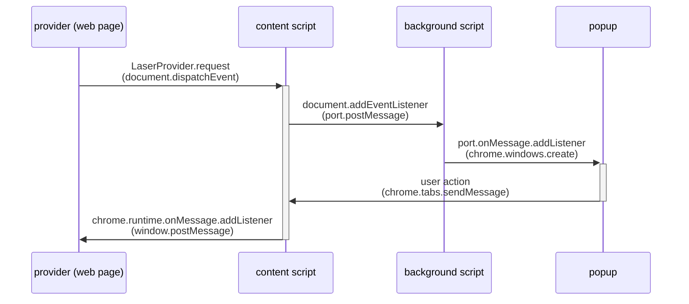

# Wallet <> App Template


This template showcases a minimal setup of a Stacks wallet extension that adheres to the new [@stacks/connect](https://github.com/hirosystems/connect) version and based off of the standards outlined in [WBIP](https://wbips.netlify.app/).

The template comprises of 3 folders:

- `clarity`: A Clarinet project that houses a simple counter contract.
- `front-end`: A front-end app, powered by Vue/Vite, supporting the new @stacks/connect v8 methods for interacting with the wallet and the Clarity contract.
- `wallet-extension`: A minimally viable wallet extension app, built with Vue/Vite, supporting the new communication standard in how it should interact with Stacks applications.

An overview diagram of how the 3 separate folders work together.


This example template is intended for educational purposes only. The provided smart contracts have not been audited.

## Understanding the Wallet Extension <> Front-End App communication



These communication flows are based off of standards like WBIPs and SIP-030 to allow wallets to communicate with apps in a more simplified and flexible way.

> IMPORTANT: The browser wallet extension template will store the generated mneomic seed phrase in the browser's local storage without any standard encryption best practices. If you plan to use this in a production environment, implement secure best practices for the safe storage of users' mnemonic seed phrases.

## Development

To run this app with a Stacks Devnet (private development blockchain environment), follow these steps:

2. **Configure Local Environment**

From the root directory, install dependencies:

```bash
npm install
```

In the `front-end` directory, create an `.env` file using the existing `.env.example` file:

```bash
cp front-end/.env.example front-end/.env
```

Add your Hiro Platform API key to the renamed `front-end/.env` file:

```bash
VITE_PLATFORM_HIRO_API_KEY=your-api-key-here
```

1. **Start Devnet in Hiro Platform**

   - Log into the [Hiro Platform](https://platform.hiro.so)
   - Navigate to your project and start Devnet (do not opt to update the Devnet deployment plan, as it's pre-configured with some contract calls to initialize the project)
   - Copy your API key from either:
     - The Devnet Stacks API URL: `https://api.platform.hiro.so/v1/ext/<YOUR-API-KEY>/stacks-blockchain-api`
     - Or from https://platform.hiro.so/settings/api-keys

2. **Bundle and Enable Wallet Extension in Browser**

- Run `npm run build` in the `wallet-extension` directory or `npm run build --workspace=wallet-extension` in the root directory.
- The generated build file will live in a new `dist/` folder which will be added as a Chrome extension in your browser:
  1. Enable Developer Mode:
  - Open Chrome and go to chrome://extensions/.
  - Toggle on the "Developer mode" switch in the top right corner.
  2. Load the Unpacked Extension:
  - Click the "Load unpacked" button.
  - Navigate to the folder containing your extension's files and click "Select Folder".
  - Chrome will then load and install the extension.
  - Enable and pin the extension to your browser.

3. **Start the Frontend Application**

Start the Vue/Vite application from the `front-end` directory.

```bash
cd front-end
npm run dev
```

Visit `[http://localhost:5173](http://localhost:5173)` in your browser to view and interact with the app. If devnet is running and the wallet extension is enabled in your browser, then you should be able to connect the app with the wallet to interact with the @stacks/connect methods.

## About the Smart Contract

This app uses a Clarity smart contract which handles the incrementing of a variable.

### `counter.clar`

- `increment`: Allows the incrementing of a uint variable.
- `get-count`: Returns the current uint `count` variable.

## Testing with Devnet

The Hiro Platform's Devnet is a sandboxed, personal blockchain environment for testing your dApps before deploying them to the testnet or mainnet. Each time you start a new Devnet, it will reset the blockchain state and deploy your project contracts from scratch.

This is useful because deployments to the blockchain are permanent and cannot be undone. Ensure you have tested your contracts thoroughly in your Devnet before promoting them to Testnet or Mainnet.

If you make changes to your contract, you will need to push your changes and restart Devnet for the contract changes to appear in your Devnet.

## Next Steps

Once you've thoroughly tested your dApp in Devnet and are confident in its functionality, you can proceed to building out the wallet extension to support more standard features such as:

- Fetching account balances using Hiro's Stacks APIs
- Fetching Ordinals/Runes activities with the Ordinals/Runes API powered by Hiro
- Supporting all the `stx_*` [methods](https://wbips.netlify.app/request_api/stx/stx_transferStx) available outline in the WBIP
- Supporting native bitcoin functions
- Supporting NFTs
- Implementing proper mnenomic seed phrase encryption for user security
- Enabling network switching
